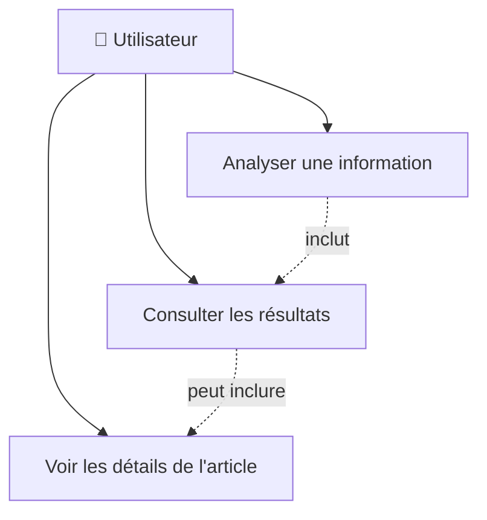
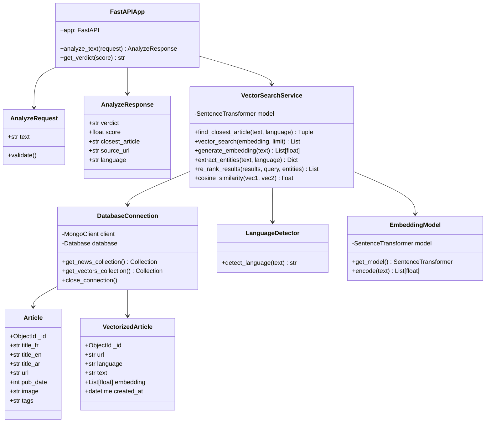
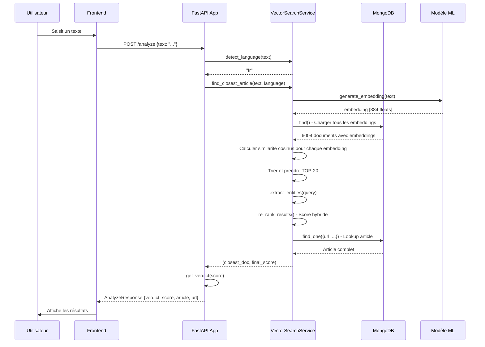
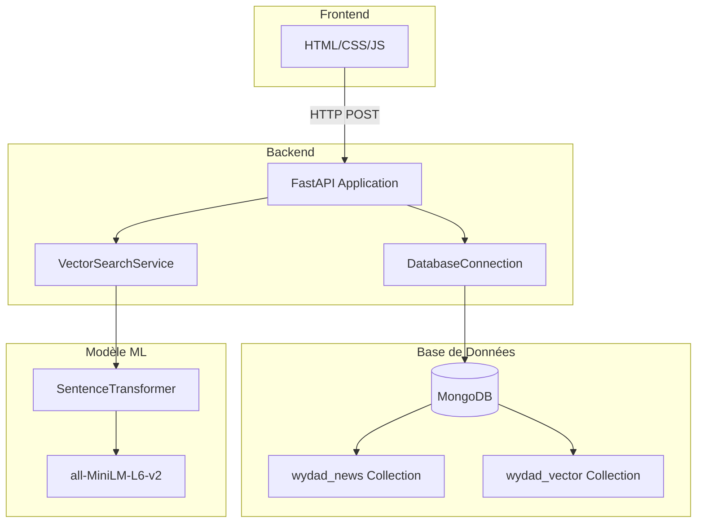
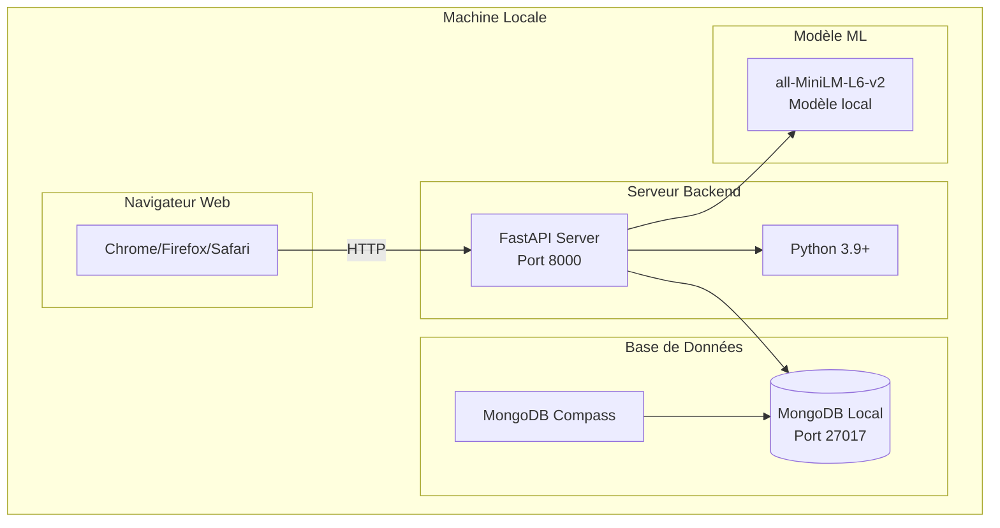
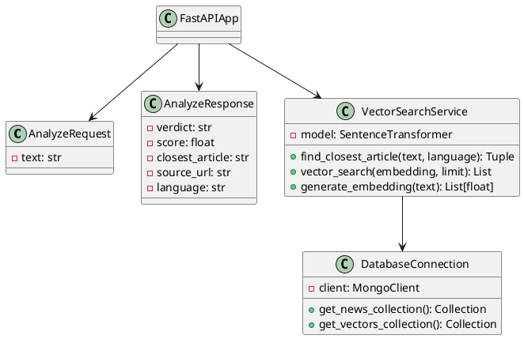

# 📊 Diagrammes UML pour le Projet de Détection de Fausses Nouvelles

## 🎯 Diagrammes Recommandés pour votre Projet

### 1. **Diagramme de Cas d'Utilisation** (Use Case Diagram)
- **Utilité** : Montre les interactions entre l'utilisateur et le système
- **Acteurs** : Utilisateur (sans authentification nécessaire)
- **Cas d'utilisation** : Analyser une information, Consulter les résultats

### 2. **Diagramme de Classe** (Class Diagram)
- **Utilité** : Structure des classes et leurs relations
- **Classes principales** : Modèles de données (AnalyzeRequest, AnalyzeResponse), Services (VectorSearch, DatabaseConnection), Modèle ML (SentenceTransformer)

### 3. **Diagramme de Séquence** (Sequence Diagram)
- **Utilité** : Flux d'exécution d'une requête d'analyse
- **Montre** : Interaction entre Frontend → Backend → MongoDB → Modèle ML

### 4. **Diagramme de Composants** (Component Diagram)
- **Utilité** : Architecture des composants du système
- **Composants** : Frontend, Backend API, Base de données, Modèle ML

### 5. **Diagramme de Déploiement** (Deployment Diagram)
- **Utilité** : Architecture physique du système
- **Montre** : Navigateur web, Serveur FastAPI, MongoDB local

---

## 📋 1. Diagramme de Cas d'Utilisation

### Entités et Acteurs

**Acteur** :
- **Utilisateur** : Personne qui utilise l'application web pour vérifier une information

**Cas d'utilisation** :
1. **Analyser une information** : L'utilisateur saisit un texte et demande une analyse
2. **Consulter les résultats** : L'utilisateur visualise le verdict, le score et l'article le plus proche
3. **Voir les détails de l'article** : L'utilisateur accède à l'URL source de l'article

### Diagramme de Cas d'Utilisation (Format Mermaid)



### Description Textuelle

```
┌─────────────────────────────────────────┐
│         Système de Détection            │
│         de Fausses Nouvelles            │
└─────────────────────────────────────────┘
              │
              │
    ┌─────────┴─────────┐
    │                   │
    ▼                   ▼
┌─────────┐      ┌──────────────┐
│ Analyser│      │ Consulter les│
│ une info│      │   résultats  │
└─────────┘      └──────────────┘
    │                   │
    └─────────┬─────────┘
              │
              ▼
    ┌──────────────────┐
    │ Voir les détails │
    │   de l'article   │
    └──────────────────┘

Acteur: 👤 Utilisateur
```

---

## 🏗️ 2. Diagramme de Classe

### Entités Identifiées

**Classes principales** :

1. **AnalyzeRequest** (Modèle de données)
   - Attributs : `text: str`
   - Méthodes : Validation

2. **AnalyzeResponse** (Modèle de données)
   - Attributs : `verdict: str`, `score: float`, `closest_article: str`, `source_url: str`, `language: str`

3. **VectorSearchService** (Service de recherche)
   - Méthodes : `find_closest_article()`, `vector_search()`, `generate_embedding()`, `extract_entities()`, `re_rank_results()`

4. **DatabaseConnection** (Service de base de données)
   - Méthodes : `get_news_collection()`, `get_vectors_collection()`, `close_connection()`

5. **LanguageDetector** (Service utilitaire)
   - Méthodes : `detect_language()`

6. **EmbeddingModel** (Modèle ML)
   - Attributs : `model: SentenceTransformer`
   - Méthodes : `get_model()`, `encode()`

7. **Article** (Entité métier)
   - Attributs : `_id`, `title_fr`, `title_en`, `url`, `pub_date`, etc.

8. **VectorizedArticle** (Entité métier)
   - Attributs : `_id`, `url`, `language`, `text`, `embedding`, `created_at`

### Diagramme de Classe (Format Mermaid)



### Diagramme de Classe Détaillé (Format Textuel)

```
┌─────────────────────────────────────────────────────────────┐
│                      FastAPIApp                            │
├─────────────────────────────────────────────────────────────┤
│ - app: FastAPI                                              │
├─────────────────────────────────────────────────────────────┤
│ + analyze_text(request: AnalyzeRequest) : AnalyzeResponse  │
│ + get_verdict(score: float) : str                          │
│ + startup_event()                                           │
│ + shutdown_event()                                          │
└─────────────────────────────────────────────────────────────┘
                            │
                            │ utilise
                            ▼
┌─────────────────────────────────────────────────────────────┐
│                   AnalyzeRequest                            │
├─────────────────────────────────────────────────────────────┤
│ - text: str                                                 │
└─────────────────────────────────────────────────────────────┘

┌─────────────────────────────────────────────────────────────┐
│                   AnalyzeResponse                           │
├─────────────────────────────────────────────────────────────┤
│ - verdict: str                                              │
│ - score: float                                              │
│ - closest_article: str                                      │
│ - source_url: str                                           │
│ - language: str                                             │
└─────────────────────────────────────────────────────────────┘

┌─────────────────────────────────────────────────────────────┐
│                VectorSearchService                          │
├─────────────────────────────────────────────────────────────┤
│ - model: SentenceTransformer                                │
│ - KNOWN_PLAYERS: Set[str]                                   │
│ - KNOWN_CLUBS: Set[str]                                     │
│ - ACTION_KEYWORDS: Dict[str, Set[str]]                     │
├─────────────────────────────────────────────────────────────┤
│ + find_closest_article(text, language) : Tuple             │
│ + vector_search(embedding, limit) : List[Dict]           │
│ + generate_embedding(text) : List[float]                   │
│ + extract_entities(text, language) : Dict                 │
│ + re_rank_results(results, query, entities) : List         │
│ + cosine_similarity(vec1, vec2) : float                    │
│ + detect_language(text) : str                              │
│ - normalize_vector(vec) : np.ndarray                        │
│ - calculate_entity_match_score() : float                   │
│ - calculate_keyword_overlap_score() : float                │
└─────────────────────────────────────────────────────────────┘
                            │
                            │ utilise
        ┌───────────────────┼───────────────────┐
        │                   │                   │
        ▼                   ▼                   ▼
┌───────────────┐  ┌──────────────┐  ┌──────────────────┐
│DatabaseConnect│  │EmbeddingModel│  │LanguageDetector  │
├───────────────┤  ├──────────────┤  ├──────────────────┤
│-client        │  │-model        │  │                  │
│-database      │  │              │  │                  │
├───────────────┤  ├──────────────┤  ├──────────────────┤
│+get_news_     │  │+get_model()  │  │+detect_language()│
│ collection()  │  │+encode()     │  │                  │
│+get_vectors_  │  │              │  │                  │
│ collection()  │  │              │  │                  │
│+close_        │  │              │  │                  │
│ connection()  │  │              │  │                  │
└───────────────┘  └──────────────┘  └──────────────────┘
        │
        │ accède à
        ▼
┌─────────────────────────────────────────────────────────────┐
│                         Article                             │
├─────────────────────────────────────────────────────────────┤
│ - _id: ObjectId                                             │
│ - title_fr: str                                              │
│ - title_en: str                                              │
│ - title_ar: str                                              │
│ - url: str                                                   │
│ - pub_date: int                                              │
│ - image: str                                                 │
│ - tags: str                                                  │
│ - scraped_at: datetime                                       │
└─────────────────────────────────────────────────────────────┘

┌─────────────────────────────────────────────────────────────┐
│                   VectorizedArticle                         │
├─────────────────────────────────────────────────────────────┤
│ - _id: ObjectId                                             │
│ - url: str                                                   │
│ - language: str                                              │
│ - text: str                                                  │
│ - embedding: List[float] (384 dimensions)                    │
│ - created_at: datetime                                       │
└─────────────────────────────────────────────────────────────┘
```

---

## 🔄 3. Diagramme de Séquence

### Diagramme de Séquence (Format Mermaid)



---

## 🧩 4. Diagramme de Composants

### Diagramme de Composants (Format Mermaid)



---

## 🖥️ 5. Diagramme de Déploiement

### Diagramme de Déploiement (Format Mermaid)



---

## 📝 Notes pour la Documentation

### Points à Mentionner dans votre Rapport

1. **Pas d'authentification** : Le système est ouvert, pas de gestion d'utilisateurs
2. **Architecture simple** : Frontend → Backend → Base de données
3. **Modèle ML intégré** : Sentence-transformers chargé en mémoire
4. **Base de données locale** : MongoDB local (pas de cloud)

### Diagrammes à Inclure dans votre Rapport

**Minimum requis** :
1. ✅ Diagramme de Cas d'Utilisation
2. ✅ Diagramme de Classe
3. ✅ Diagramme de Séquence

**Optionnels (pour plus de détails)** :
4. Diagramme de Composants
5. Diagramme de Déploiement

---

## 🛠️ Outils pour Créer les Diagrammes

1. **Draw.io / diagrams.net** (gratuit, en ligne)
2. **Lucidchart** (gratuit avec limitations)
3. **PlantUML** (gratuit, basé sur texte)
4. **Visual Paradigm** (gratuit pour étudiants)
5. **Mermaid** (gratuit, intégré dans Markdown)

### Exemple PlantUML (pour diagramme de classe)



---

## ✅ Résumé

**Diagrammes recommandés** :
1. ✅ **Cas d'utilisation** : Montre l'interaction utilisateur-système
2. ✅ **Classe** : Structure des classes et relations
3. ✅ **Séquence** : Flux d'exécution d'une requête

**Entités principales** :
- **Utilisateur** (acteur unique, pas d'authentification)
- **Classes métier** : AnalyzeRequest, AnalyzeResponse, Article, VectorizedArticle
- **Services** : VectorSearchService, DatabaseConnection, LanguageDetector
- **Modèle ML** : EmbeddingModel (SentenceTransformer)

Ces diagrammes montrent clairement l'architecture de votre système sans nécessiter d'authentification ou de gestion d'utilisateurs complexes.

